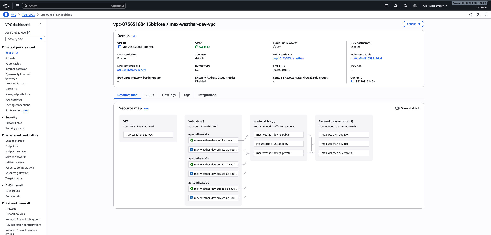
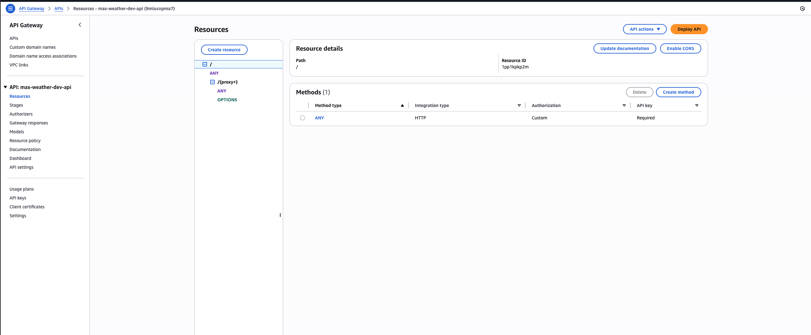
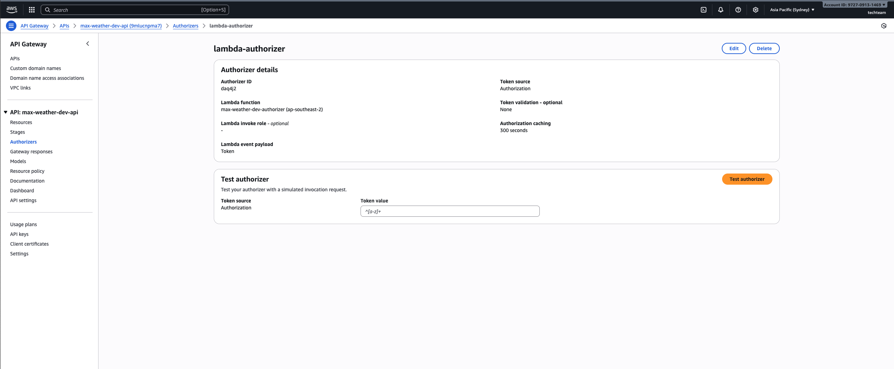
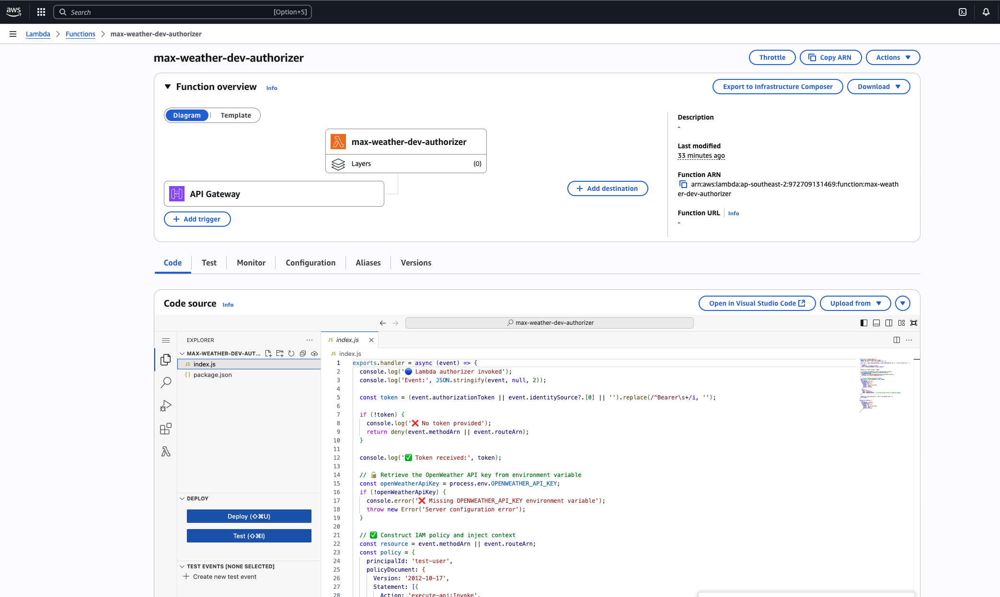
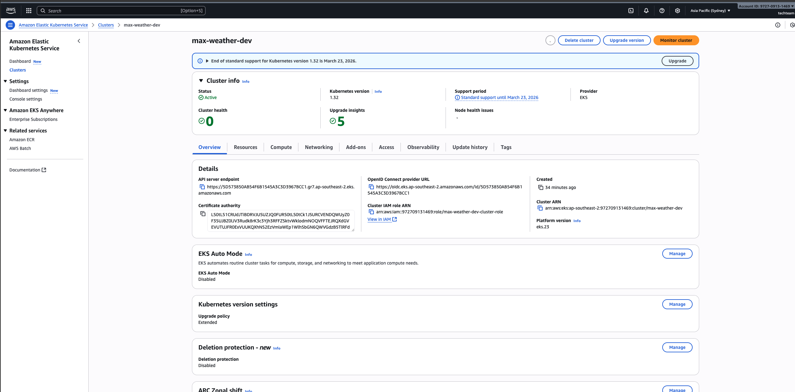
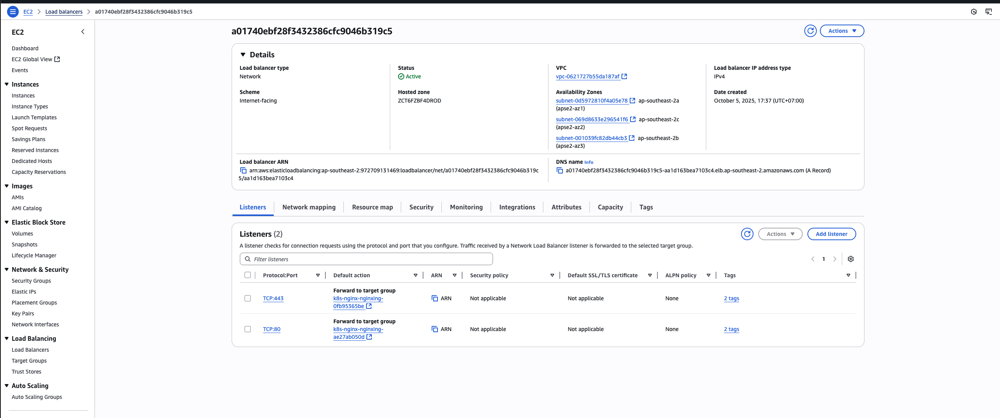
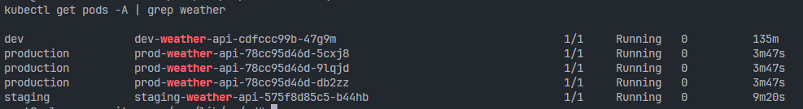
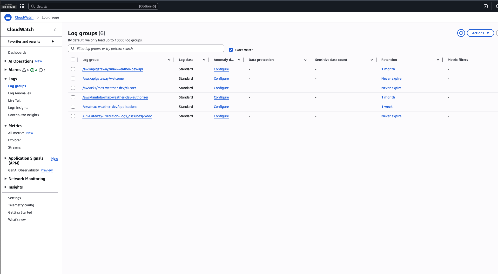

## IAC deployment

This repository provisions a concise AWS foundation for the Max Weather app using Terraform and Kubernetes. It deploys a VPC, EKS with managed node groups (on-demand and spot), IRSA-based IAM, an internal NLB via nginx ingress, API Gateway with Lambda authorizer, ECR, and CloudWatch logging/alarms. Cost is minimized (single NAT) while keeping production-aligned patterns (IRSA, private ingress, endpoint policies).

Key defaults and decisions:
- Single NAT Gateway with one private route table shared by all private subnets (cost-optimized)
- Internal NLB only (ingress) placed in private subnets; API Gateway is the external entry point
- IRSA everywhere (Fluent Bit to CloudWatch; nginx ingress LB permissions; optional ExternalDNS)
- Karpenter IAM included (controller IRSA and node instance profile) behind a toggle for easy autoscaling enablement
- ECR with scan-on-push and lifecycle policy

How to deploy (example: dev environment):
1. cd iac/terraform/environments/dev
2. terraform init && terraform apply
3. aws eks update-kubeconfig --region <region> --name <cluster-name>
4. Deploy k8s manifests via kustomize/helm (see k8s/kustomize/README.md)

Toggles (root variables):
- enable_ondemand_node_group, enable_spot_node_group
- enable_ebs_csi_driver
- enable_karpenter, karpenter_service_account
- permission_boundary_arn
- ecr_* (repo names, mutability, lifecycle)

Terraform resources for whole project:
```
module.root.data.aws_availability_zones.available
module.root.data.aws_caller_identity.current
module.root.module.api_gateway.aws_api_gateway_account.account
module.root.module.api_gateway.aws_api_gateway_api_key.this
module.root.module.api_gateway.aws_api_gateway_authorizer.lambda
module.root.module.api_gateway.aws_api_gateway_deployment.this
module.root.module.api_gateway.aws_api_gateway_integration.proxy
module.root.module.api_gateway.aws_api_gateway_integration.proxy_options
module.root.module.api_gateway.aws_api_gateway_integration.root_proxy
module.root.module.api_gateway.aws_api_gateway_integration_response.proxy_options
module.root.module.api_gateway.aws_api_gateway_method.proxy_any
module.root.module.api_gateway.aws_api_gateway_method.proxy_options
module.root.module.api_gateway.aws_api_gateway_method.root_any
module.root.module.api_gateway.aws_api_gateway_method_response.proxy_options
module.root.module.api_gateway.aws_api_gateway_model.request
module.root.module.api_gateway.aws_api_gateway_model.response
module.root.module.api_gateway.aws_api_gateway_resource.proxy
module.root.module.api_gateway.aws_api_gateway_rest_api.this
module.root.module.api_gateway.aws_api_gateway_stage.this["dev"]
module.root.module.api_gateway.aws_api_gateway_usage_plan.this
module.root.module.api_gateway.aws_api_gateway_usage_plan_key.this
module.root.module.api_gateway.aws_cloudwatch_log_group.apigw
module.root.module.api_gateway.aws_iam_role.apigw_cloudwatch
module.root.module.api_gateway.aws_iam_role_policy.apigw_cloudwatch
module.root.module.cloudwatch.data.aws_iam_policy_document.fluent_bit
module.root.module.cloudwatch.data.aws_iam_policy_document.fluent_bit_assume
module.root.module.cloudwatch.aws_cloudwatch_log_group.applications
module.root.module.cloudwatch.aws_cloudwatch_metric_alarm.api_latency[0]
module.root.module.cloudwatch.aws_cloudwatch_metric_alarm.cpu_high[0]
module.root.module.cloudwatch.aws_cloudwatch_metric_alarm.memory_high[0]
module.root.module.cloudwatch.aws_cloudwatch_metric_alarm.pod_restarts[0]
module.root.module.cloudwatch.aws_iam_policy.fluent_bit
module.root.module.cloudwatch.aws_iam_role.fluent_bit
module.root.module.cloudwatch.aws_iam_role_policy_attachment.fluent_bit
module.root.module.cloudwatch.aws_sns_topic.alerts
module.root.module.ecr.aws_ecr_lifecycle_policy.this["max-weather-dev"]
module.root.module.ecr.aws_ecr_repository.this["max-weather-dev"]
module.root.module.eks.data.aws_eks_cluster_auth.this
module.root.module.eks.data.aws_iam_policy_document.oidc
module.root.module.eks.data.tls_certificate.oidc
module.root.module.eks.aws_eks_addon.coredns
module.root.module.eks.aws_eks_addon.kube_proxy
module.root.module.eks.aws_eks_cluster.this
module.root.module.eks.aws_eks_node_group.ondemand[0]
module.root.module.eks.aws_eks_node_group.spot[0]
module.root.module.eks.aws_iam_openid_connect_provider.this
module.root.module.eks.aws_iam_role.cluster
module.root.module.eks.aws_iam_role.nodes
module.root.module.eks.aws_iam_role_policy_attachment.cluster
module.root.module.eks.aws_iam_role_policy_attachment.nodes_cni
module.root.module.eks.aws_iam_role_policy_attachment.nodes_ecr
module.root.module.eks.aws_iam_role_policy_attachment.nodes_worker
module.root.module.eks.aws_security_group.cluster
module.root.module.eks.aws_security_group.nodes
module.root.module.iam.data.aws_iam_openid_connect_provider.this[0]
module.root.module.iam.data.aws_iam_policy_document.app_irsa
module.root.module.iam.data.aws_iam_policy_document.karpenter_controller
module.root.module.iam.data.tls_certificate.oidc
module.root.module.iam.aws_iam_instance_profile.karpenter[0]
module.root.module.iam.aws_iam_policy.aws_load_balancer_controller
module.root.module.iam.aws_iam_policy.karpenter_controller[0]
module.root.module.iam.aws_iam_role.app_irsa
module.root.module.iam.aws_iam_role.aws_load_balancer_controller
module.root.module.iam.aws_iam_role.karpenter_controller[0]
module.root.module.iam.aws_iam_role.karpenter_node[0]
module.root.module.iam.aws_iam_role.lambda_authorizer
module.root.module.iam.aws_iam_role_policy_attachment.aws_load_balancer_controller
module.root.module.iam.aws_iam_role_policy_attachment.karpenter_cni[0]
module.root.module.iam.aws_iam_role_policy_attachment.karpenter_controller[0]
module.root.module.iam.aws_iam_role_policy_attachment.karpenter_node_worker[0]
module.root.module.iam.aws_iam_role_policy_attachment.karpenter_registry[0]
module.root.module.iam.aws_iam_role_policy_attachment.lambda_basic
module.root.module.lambda_authorizer.data.archive_file.zip
module.root.module.lambda_authorizer.aws_cloudwatch_log_group.this
module.root.module.lambda_authorizer.aws_iam_role.this
module.root.module.lambda_authorizer.aws_iam_role_policy_attachment.basic
module.root.module.lambda_authorizer.aws_lambda_function.this
module.root.module.lambda_authorizer.aws_lambda_permission.api_gateway
module.root.module.vpc.data.aws_availability_zones.available
module.root.module.vpc.aws_eip.nat
module.root.module.vpc.aws_internet_gateway.this
module.root.module.vpc.aws_nat_gateway.this
module.root.module.vpc.aws_route.private_nat
module.root.module.vpc.aws_route.public_internet
module.root.module.vpc.aws_route_table.private
module.root.module.vpc.aws_route_table.public
module.root.module.vpc.aws_route_table_association.private["0"]
module.root.module.vpc.aws_route_table_association.private["1"]
module.root.module.vpc.aws_route_table_association.private["2"]
module.root.module.vpc.aws_route_table_association.public["0"]
module.root.module.vpc.aws_route_table_association.public["1"]
module.root.module.vpc.aws_route_table_association.public["2"]
module.root.module.vpc.aws_security_group.endpoints
module.root.module.vpc.aws_subnet.private["0"]
module.root.module.vpc.aws_subnet.private["1"]
module.root.module.vpc.aws_subnet.private["2"]
module.root.module.vpc.aws_subnet.public["0"]
module.root.module.vpc.aws_subnet.public["1"]
module.root.module.vpc.aws_subnet.public["2"]
module.root.module.vpc.aws_vpc.this
module.root.module.vpc.aws_vpc_endpoint.ecr_api
module.root.module.vpc.aws_vpc_endpoint.ecr_dkr
module.root.module.vpc.aws_vpc_endpoint.logs
module.root.module.vpc.aws_vpc_endpoint.s3
```

**VPC:**


**API Gateway:**





**Lambda function authorizer:**


**EKS Cluster:**


**Network load balancer:**


**EKS pods:**


**Cloudwatch:**
