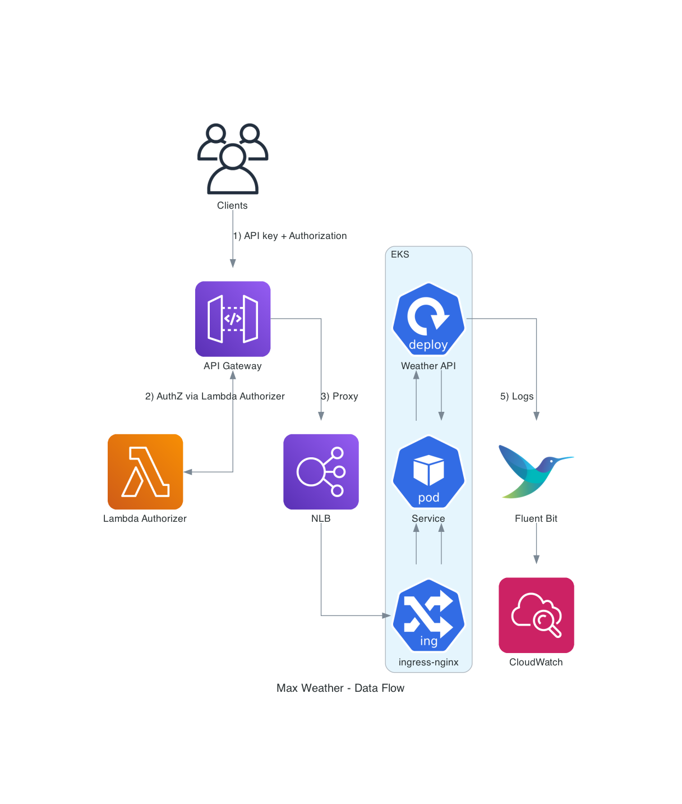

# Max Weather API - Infrastructure Assessment

A simplified weather API proxy/mock demonstrating AWS infrastructure capabilities for high availability, auto-scaling, and OAuth2 authorization.

## Project Structure

```
max-weather-iac/
├── app/                             # Application code
│   ├── Dockerfile                   # Multi-stage Node.js build
│   ├── app.js                       # Minimal Express proxy/mock
│   └── package.json                 # Node.js dependencies
├── iac/                             # Infrastructure as Code
│   ├── terraform/                   # Terraform configurations
│   │   ├── modules/                 # Reusable modules
│   │   │   ├── vpc/                 # VPC, subnets, NAT, endpoints
│   │   │   ├── eks/                 # EKS cluster + node groups
│   │   │   ├── cloudwatch/          # Log groups + Fluent Bit
│   │   │   ├── api-gateway/         # REST API + usage plans
│   │   │   ├── lambda-authorizer/   # OAuth2/JWT authorizer
│   │   │   ├── ecr/                 # ECR repository
│   │   │   └── iam/                 # IAM roles + IRSA
│   │   ├── environments/            # Environment-specific configs
│   │   │   ├── dev/                 # Development environment
│   │   │   ├── staging/             # Staging environment
│   │   │   └── production/          # Production environment
│   │   ├── main.tf                  # Root module configuration
│   │   ├── variables.tf             # Input variables
│   │   ├── outputs.tf               # Output values
│   │   └── versions.tf              # Provider constraints
│   └── lambda/                      # Lambda authorizer
│       └── authorizer/              # OAuth2/JWT validation
│           ├── index.js             # Authorizer logic
│           └── package.json         # Dependencies
├── k8s/                             # Kubernetes manifests
│   ├── charts/                      # Helm charts
│   │   ├── ingress-nginx/           # NGINX Ingress Controller
│   │   └── karpenter/               # Karpenter for node auto-scaling
│   └── kustomize/                   # Kustomize configurations
│       ├── base/                    # Base configurations
│       │   ├── weather-api/         # Application resources
│       │   └── fluentbit/           # Logging configuration
│       ├── overlays/                # Environment overlays
│       │   ├── weather-api/         # Environment-specific app configs
│       │   └── fluentbit/           # Environment-specific logging
│       └── deploy-*.sh              # Deployment scripts
├── jenkins/                         # Jenkins CI/CD setup
│   ├── init.groovy.d/               # Jenkins initialization scripts
│   ├── jobs/                        # Jenkins job definitions
│   ├── scripts/                     # Utility scripts
│   ├── docker-compose.yml           # Jenkins container setup
│   └── README.md                    # Jenkins documentation
├── docs/                            # Documentation
│   ├── ARCHITECTURE.md              # System architecture
│   ├── CICD.md                      # CI/CD documentation
│   ├── DEPLOYMENT.md                # Deployment guide
│   ├── diagrams/                    # Architecture diagrams
│   └── images/                      # Documentation images
├── postman/                         # API testing
│   └── Max_Weather_API.postman_collection.json
├── docker-compose.jenkins.yml       # Jenkins Docker Compose
├── Jenkinsfile.staging              # CI/CD pipeline for staging
├── Jenkinsfile.production           # CI/CD pipeline for production
├── IAC_DEPLOY_RESULT.md             # Infrastructure deployment results
└── README.md                        # This file
```

## Infrastructure Architecture


## Key Features

### 1. High Availability & Fault Tolerance
- **Multi-AZ deployment**: 3 public + 3 private subnets across availability zones
- **NAT Gateway per AZ**: High availability for private subnet internet access
- **Pod anti-affinity**: Weather API pods spread across different nodes
- **3 replicas minimum**: Ensures service availability during node failures

### 2. Auto-Scaling for Traffic Spikes
- **Horizontal Pod Autoscaler (HPA)**: Scales pods based on CPU/memory usage
  - Min: 2 replicas, Max: 20 replicas
  - CPU target: 70%, Memory target: 80%
- **EKS Node Group Auto-scaling**: Scales worker nodes based on pod scheduling needs using Karpenter
- **API Gateway throttling**: Protects backend from traffic spikes

### 3. API Exposure
- **NGINX Ingress Controller**: Load balancer with TLS termination
- **API Gateway**: REST API with usage plans and API keys
- **Path-based routing**: `/api/v1/weather` endpoint
- **CORS support**: Cross-origin requests enabled

### 4. OAuth2 Authorization
- **Lambda Authorizer**: Validates JWT tokens and OAuth2 introspection
- **Token caching**: 5-minute TTL for performance
- **API Gateway integration**: Custom authorizer for all endpoints
- **IRSA (IAM Roles for Service Accounts)**: Secure AWS service access

### 5. CI/CD Pipeline
- **Jenkins Pipeline**: Multi-stage deployment with automated setup
  - Build & Test → Deploy to Staging → Manual Approval → Deploy to Production
- **Jenkins Configuration as Code**: Automated Jenkins setup with plugins and credentials
- **Multi-environment support**: Development, staging, and production pipelines
- **Rollout Deployment**: Zero-downtime deployments using Kustomize
- **Rollback capability**: Automatic rollback on deployment failures

### 6. CloudWatch Logging
- **Fluent Bit DaemonSet**: Ships container logs to CloudWatch
- **Log retention**: 7 days (staging), 30 days (production)
- **Container Insights**: EKS cluster monitoring
- **Alarms**: CPU, memory, pod restart notifications via SNS

## Application

The weather API is intentionally simplified to focus on infrastructure capabilities:

- **Mock Mode**: Returns static weather data when no API key is configured
- **Proxy Mode**: Forwards requests to OpenWeatherMap when API key is provided
- **Health Check**: `/health` endpoint for Kubernetes liveness/readiness probes
- **Minimal Dependencies**: Only Express.js, CORS, and Axios for external calls

## Quick Start

### Prerequisites
- AWS CLI configured
- Terraform >= 1.5
- kubectl
- Docker

### Deploy Infrastructure

1. **Configure backend** (replace placeholders in `iac/terraform/main.tf`):
   ```bash
   # Update S3 bucket and DynamoDB table names
   ```

2. **Deploy to development**:
   ```bash
   cd iac/terraform/environments/dev
   terraform init
   terraform plan -var-file=terraform.tfvars
   terraform apply -var-file=terraform.tfvars
   ```

3. **Deploy to staging**:
   ```bash
   cd iac/terraform/environments/staging
   terraform init
   terraform plan -var-file=terraform.tfvars
   terraform apply -var-file=terraform.tfvars
   ```

4. **Deploy to production**:
   ```bash
   cd iac/terraform/environments/production
   terraform init
   terraform plan -var-file=terraform.tfvars
   terraform apply -var-file=terraform.tfvars
   ```

### Deploy Application

1. **Update kubeconfig**:
   ```bash
   aws eks update-kubeconfig --region us-east-1 --name <cluster-name>
   ```

2. **Deploy using Kustomize**:
   ```bash
   # For development
   ./k8s/kustomize/deploy-dev.sh
   
   # For staging
   ./k8s/kustomize/deploy-staging.sh
   
   # For production
   ./k8s/kustomize/deploy-production.sh
   ```

3. **Deploy Fluent Bit for logging**:
   ```bash
   ./k8s/kustomize/deploy-fluentbit.sh
   ```

### Setup Jenkins CI/CD

1. **Start Jenkins**:
   ```bash
   cd jenkins
   docker-compose up -d
   ```

2. **Access Jenkins**: Navigate to `http://localhost:8080`

3. **Configure credentials**: Jenkins will automatically configure AWS and Kubernetes credentials

4. **Run seed job**: The initial seed job will create all pipeline jobs

### Test API

1. **Import Postman collection**: `postman/Max_Weather_API.postman_collection.json`
2. **Configure environment**: Set API Gateway URL and API key
3. **Test OAuth2 flow**: Get access token, then call weather API
4. **Verify responses**: Should return mock weather data

## Environment Variables

| Variable | Description | Default |
|----------|-------------|---------|
| `OPENWEATHER_API_KEY` | OpenWeatherMap API key (optional) | - |
| `PORT` | Application port | 3000 |

## Monitoring

- **CloudWatch Logs**: `/aws/eks/<cluster>/applications`
- **Container Insights**: EKS cluster metrics
- **Alarms**: CPU > 80%, Memory > 85%, Pod restarts
- **SNS Notifications**: Email alerts for critical issues

## Security

- **Private subnets**: Worker nodes in private subnets only
- **IRSA**: Fine-grained IAM permissions for service accounts
- **TLS termination**: At load balancer and API Gateway
- **Network policies**: Restricted pod-to-pod communication
- **OAuth2 validation**: JWT token validation for all API calls

## Troubleshooting

### Application Issues
- **Pod issues**: `kubectl logs -f deploy/weather-api`
- **HPA status**: `kubectl get hpa weather-api`
- **Ingress status**: `kubectl describe ingress weather-api`
- **CloudWatch logs**: Check `/aws/eks/<cluster>/applications` log group

### Infrastructure Issues
- **Terraform state**: Check `iac/terraform/environments/<env>/terraform.tfstate`
- **EKS cluster**: `aws eks describe-cluster --name <cluster-name>`
- **VPC connectivity**: Check security groups and NACLs

### Jenkins Issues
- **Jenkins logs**: `docker-compose logs jenkins`
- **Pipeline failures**: Check Jenkins console output
- **Credential issues**: Verify AWS and Kubernetes credentials in Jenkins

