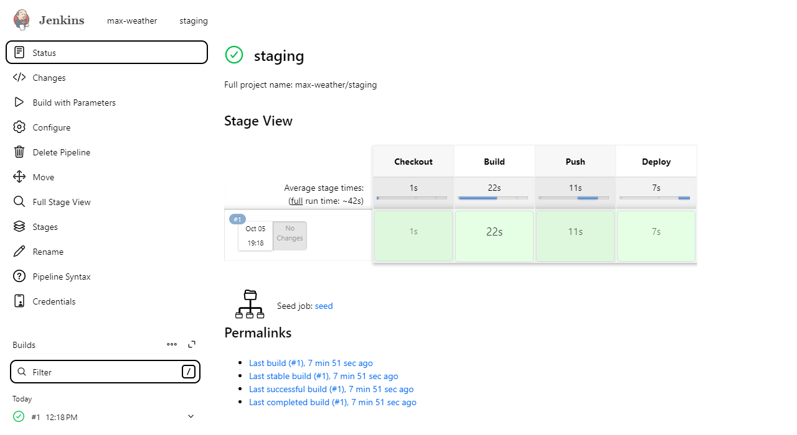
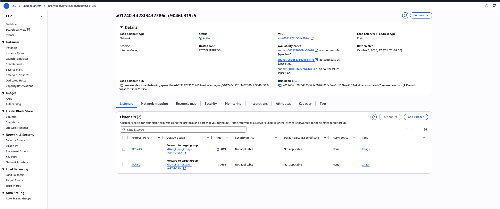

# CI/CD Documentation

## Overview

This document describes the Continuous Integration and Continuous Deployment (CI/CD) flow for both **Staging** and **Production** environments.  
The pipelines are implemented in Jenkins and automate the process of building, publishing, and deploying Docker images to Kubernetes.

---

## CI/CD Flow

### 1. Staging Pipeline

**Steps:**
1. Check out the latest code from the `main` branch.  
2. Build a Docker image using the **tag** provided from the Jenkins job input.  
3. Push the built image to **Amazon ECR**.  
4. Update the Kubernetes manifest file with the new image tag.  
5. Apply the updated manifest to the Kubernetes cluster.  
6. Commit and push the manifest changes back to the Git repository.

---

### 2. Production Pipeline

**Steps:**
1. Check out the latest code from the `main` branch.  
2. Verify that the Docker image with the provided **tag** exists in **Amazon ECR**.  
3. Update the Kubernetes manifest file with the verified image tag.  
4. Apply the updated manifest to the Kubernetes cluster.  
5. Commit and push the manifest changes back to the Git repository.

## Result

## Staging pipeline

When triggering the **Staging** pipeline, we must provide the Docker image tag as a parameter.  
The tag should follow **semantic versioning** (e.g., `1.0.0`, `1.1.2`) to maintain version consistency and traceability.

## Staging success pipeline

The pipeline runs successfully after completing all stages — including building, pushing the image to ECR, updating manifests, and deploying to the Staging environment.

## Production pipeline

When triggering the **Production** pipeline, provide the image tag that has already been **tested and verified** in the Staging environment.  
This ensures that only validated builds are deployed to production.

## Production fail pipeline

If the specified image tag **does not exist** in the ECR repository, the pipeline will fail during the verification stage.  
This prevents untested or invalid images from being deployed to production.

## Production success pipeline

If the specified image tag **exists** in ECR, the pipeline proceeds successfully — updating the Kubernetes manifests and deploying the application to the k8s cluster.

## K8S pods

After the pipeline completes successfully, the new version of the service is deployed to the **Amazon EKS** cluster.  
We can verify the running pods and their statuses using `kubectl get pods`.

## Network load balancer

Internal network load balancer is created by Nginx ingress controller, and it is the endpoint which we used as an enddpoint in API Gateway.
