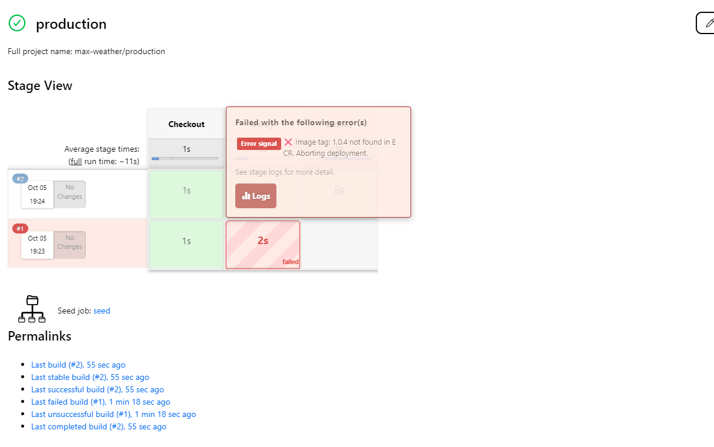
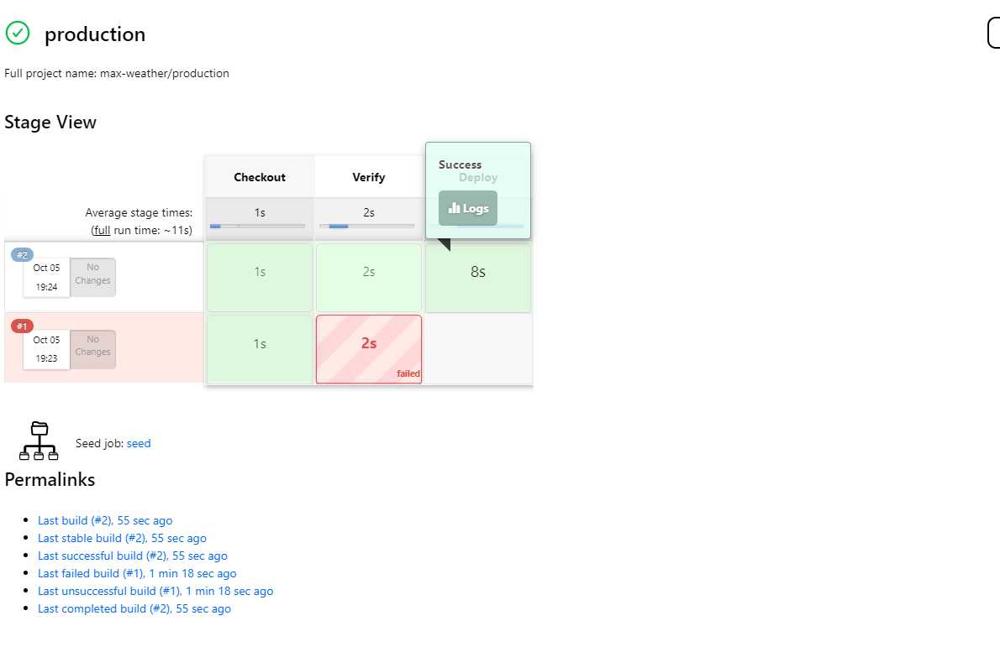

# CI/CD Documentation

## Overview

This document describes the Continuous Integration and Continuous Deployment (CI/CD) flow for both **Staging** and **Production** environments.  
The pipelines are implemented in Jenkins and automate the process of building, publishing, and deploying Docker images to Kubernetes.

---

## CI/CD Flow

### 1. Staging Pipeline

**Steps:**
1. Check out the latest code from the `main` branch.  
2. Build a Docker image using the **tag** provided from the Jenkins job input.  
3. Push the built image to **Amazon ECR**.  
4. Update the Kubernetes manifest file with the new image tag.  
5. Apply the updated manifest to the Kubernetes cluster.  
6. Commit and push the manifest changes back to the Git repository.

---

### 2. Production Pipeline

**Steps:**
1. Check out the latest code from the `main` branch.  
2. Verify that the Docker image with the provided **tag** exists in **Amazon ECR**.  
3. Update the Kubernetes manifest file with the verified image tag.  
4. Apply the updated manifest to the Kubernetes cluster.  
5. Commit and push the manifest changes back to the Git repository.

## Result

## Staging pipeline

## Staging success pipeline

## Production pipeline

## Production fail pipeline

## Production success pipeline

## K8S pods

